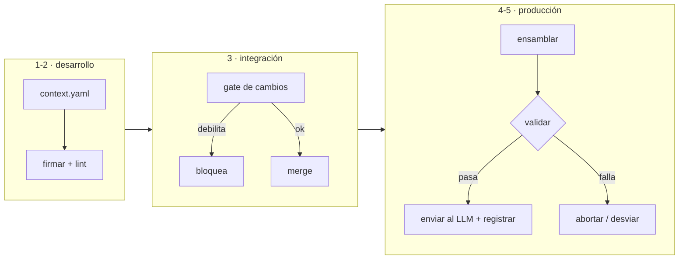

# CCDD — Context Contract-Driven Development

[](https://github.com/MauricioPerera/ccdd/actions/workflows/tests.yml)
[](LICENSE)
[](ccdd_spec_v0.3.md)

> Una **metodología de desarrollo** para construir agentes de IA confiables, basada en
> **contratos de contexto híbridos**. Como TDD pone el test primero y SDD pone la
> especificación primero, **CCDD pone el contrato de contexto primero**.

**Estado:** v0.3 (Draft) · metodología + implementación de referencia ejecutable · 51 tests verdes · validada en 2 dominios. <!-- ccdd:test-count=51 -->

**TL;DR** — Tus prompts y políticas de LLM viven como texto suelto sin versionar. CCDD los vuelve un
**contrato** (`context.yaml`) con: ✍️ firmas, 🚦 un gate de CI que bloquea regresiones de contexto,
👥 gobernanza con quórum para cambiar políticas, y 🔁 auditoría reproducible. Lo verificable lo
revisa una máquina; lo opinable, un humano.

```console
$ python ccdd.py diff contracts/support-agent contracts/support-agent-bad   # salida real, recortada
DIFF: BLOQUEADO - regresiones de contexto detectadas:
  [X] slot crítico 'policies': prioridad degradada 1 -> 3
  [X] slot 'environment' perdió la firma (sign: true -> false)
  [X] guardrail 'slot-references' eliminado
  … (6 regresiones en total)         # el merge se frena (exit 1)
```

→ **¿Por qué existe?** [Propuesta](ccdd_PROPOSAL.md) · **¿Cómo lo presento?** [Pitch](ccdd_PITCH.md) ·
**¿Cómo lo corro?** [Quickstart](#quickstart) · **Cambios:** [CHANGELOG](ccdd_CHANGELOG.md)

---

## 🎯 Para qué

> CCDD existe para que un humano pueda **delegar una tarea a una IA con confianza alta** de que
> esta no solo la **ejecutará**, sino que **verificará su propio trabajo** y **evitará alucinar**
> en lo posible.

El contrato híbrido es el instrumento: lo **verificable** lo comprueba una máquina (el humano no
tiene que creer), y lo **opinable** queda marcado como tal, con el humano en el centro de esa
decisión. Así uno sabe *hasta dónde puede soltar la mano*. (Propósito completo en el [manifiesto](ccdd_workflow.md).)

---

## Qué es CCDD

Una forma de trabajar para equipos que construyen **agentes de IA**. La idea central:

> En software clásico controlás el sistema con tipos y contratos de API. Con un LLM, lo único
> que realmente controla su comportamiento es el **contexto** que le das. CCDD trata ese
> contexto como un **contrato de primer nivel**: declarado, versionado y verificable — en vez
> de prompts sueltos y sin control repartidos por el código.

| Metodología | Pone primero | Artefacto |
| :--- | :--- | :--- |
| TDD (Test-Driven) | el comportamiento esperado | el test |
| SDD (Spec-Driven) | la estructura de datos | la especificación |
| **CCDD (Context Contract-Driven)** | **la calidad de la señal de entrada** | **el contrato de contexto** (`context.yaml`) |

---

## El contrato de contexto **híbrido** (el corazón de la idea)

Lo que hace distinta a CCDD es que el contrato **mezcla dos naturalezas** que normalmente no
conviven — y el flujo de trabajo sabe mandar cada una a donde corresponde:

| Parte **dura** (determinista, se *verifica*) | Parte **blanda** (probabilística, se *juzga*) |
| :--- | :--- |
| Estructura, presupuestos de tokens, firmas, reglas | El comportamiento real del modelo |
| Contexto **estático**: políticas, instrucciones fijas | Contexto **dinámico**: memoria, RAG, lo que escribe el usuario |
| Un **control automático** la valida | Un **humano (apoyado por un modelo)** la decide |

Ni 100% código rígido (no sirve para IA), ni 100% "ponle un prompt y reza" (no es confiable).
**Híbrido:** un contrato que combina ambas, con reglas claras para cada lado. La regla de oro:
*lo verificable va a un gate determinista; lo opinable va a una persona — el modelo informa, no decide.*

---

## El flujo de trabajo (5 etapas)

El ciclo de vida CCDD, de desarrollo a producción:

1. **Diseñar el contrato** — declarás los canales de contexto (*slots*), su prioridad y sus reglas en `context.yaml`.
2. **Firmar y verificar en local** — se firman las instrucciones fijas; un `lint` revisa que todo cierre.
3. **Integración continua** — cada cambio pasa por un *gate*: si debilita la postura del contexto, se bloquea.
4. **Ensamblar en vivo** — en producción se arma el contexto respetando el contrato y se valida *antes* de llamar al LLM.
5. **Auditar y reproducir** — se registra exactamente qué se envió, y se puede reproducir bit a bit.



---

## Cómo se adopta (gradual)

No es todo o nada. Tres niveles, cada uno incluye al anterior:

```
L1 · Core      el contrato + verificación local        (dev-time)
L2 · CI        + gate de cambios en integración         (equipo)
L3 · Runtime   + ensamblado y auditoría en producción   (producción)
```

Un equipo puede empezar por L1 (declarar y firmar el contexto) y subir cuando lo necesite.
Detalle normativo en [`ccdd_spec_v0.3.md` §5](ccdd_spec_v0.3.md).

---

## Caso real (worked example)

[**`n8n-generator`**](https://github.com/MauricioPerera/n8n-generator) aplica CCDD de punta a punta
a un agente que genera flujos de n8n (LLM local + servidor MCP). Sus prompts (`system.txt`,
`sdk_reference.txt`) son un **contrato `context.yaml`** con slots, presupuesto y guardrails — y los
tres niveles están **enforceados, no solo demostrados**:

- **L1 + L2 en CI** — un workflow corre `ccdd lint` y `ccdd diff` en cada PR, pinneado por **SHA
  inmutable** a un release de esta referencia. Es un *required check*: un cambio que debilite el
  contrato no puede mergearse.
- **L3 en runtime** — el pipeline corre `ccdd assemble` + guardrails antes de cada inferencia y
  aborta si un guardrail bloquea.
- **Gobernanza activa** — `main` está protegida; cambiar un prompt **firmado** exige una atestación
  Ed25519 de revisor, que la rama hace cumplir.

Lo que el caso demostró, **verificado en CI**:

1. El gate **bloqueó** una corrección correcta de un prompt firmado por faltarle la atestación (R6),
   y **la admitió** una vez que un humano la firmó — el mismo cambio, rojo y luego verde.
2. Un **push directo** que cambió un prompt sin atestación fue exactamente lo que R6 habría frenado;
   se cerró con la firma y se previno con la rama protegida.

Es la tesis instanciada: la IA ejecutó, el gate determinista verificó, y ningún cambio gobernado
entró sin la firma humana que la metodología **hace cumplir**.

---

## Mapa de artefactos y orden de lectura

| # | Artefacto | Qué es | Para quién |
| :-- | :--- | :--- | :--- |
| 1 | [`ccdd_workflow.md`](ccdd_workflow.md) | **Manifiesto** — la metodología, el ciclo de vida, comparativa con TDD/SDD | entender *por qué* |
| 2 | [`ccdd_spec_v0.3.md`](ccdd_spec_v0.3.md) | **Especificación** — términos, requisitos, niveles, seguridad | *implementar* |
| 3 | [`ccdd_context.schema.json`](ccdd_context.schema.json) | **Esquema formal** del `context.yaml` | validación automática |
| 4 | [`ccdd_reference/`](ccdd_reference/) | **Implementación de referencia** ejecutable + tests + ejemplos | *verlo correr* |

**Para presentar:** [`ccdd_PROPOSAL.md`](ccdd_PROPOSAL.md) (one-pager) · [`ccdd_PITCH.md`](ccdd_PITCH.md) (guion de slides).
**Apoyo:** [`ccdd_FINDINGS.md`](ccdd_FINDINGS.md) (hallazgos y lecciones) · [`ccdd_CHANGELOG.md`](ccdd_CHANGELOG.md) (deltas) · specs históricas [`v0.1`](ccdd_spec_v0.1.md) / [`v0.2`](ccdd_spec_v0.2.md). En caso de conflicto, **manda la especificación**.

---

## Quickstart

```bash
pip install pyyaml jsonschema
cd ccdd_reference

# 0 — generar un contrato base con buenas prácticas (plantilla determinista)
python ccdd.py init my-agent --name my-agent     # crea my-agent/ con políticas base vetadas
#   …completás los .txt, y firmás:  python ccdd.py lint my-agent --sign

# L1 — declarar/verificar y firmar el contrato
python ccdd.py lint contracts/support-agent --sign

# L2 — gate: ¿este cambio debilita el contexto?
python ccdd.py diff contracts/support-agent contracts/support-agent-bad

# L3 — ensamblar el contexto para una interacción real
python ccdd.py assemble contracts/support-agent --inputs inputs.json

# corré la suite de tests
python -m unittest discover -s tests -p "test_*.py"
```

(En Windows: `export PYTHONIOENCODING=utf-8`. Funciones avanzadas en `ccdd_reference/README.md`.)

---

## La capa de rigor (cómo se hace *cumplir* el contrato)

Para equipos que necesitan garantías fuertes, CCDD lleva el flujo más allá de "buenas
intenciones". Esto es **soporte de la metodología**, no su esencia — actívalo según tu riesgo:

- **Firmas e integridad** — las instrucciones fijas se firman; editarlas sin re-firmar rompe la verificación.
- **Gate de regresiones (9 reglas deterministas)** — bloquea en CI si un cambio baja el presupuesto, degrada una prioridad crítica, debilita una política, quita un guardrail, etc.
- **Gobernanza con firma y quórum** — cambiar una política de seguridad exige la **firma de un revisor autorizado** (criptográfica, no falsificable); los cambios de alto riesgo, **varias firmas**.
- **Asistente de revisión (opcional)** — un LLM local ayuda al revisor a juzgar un cambio, pero **no decide ni firma**: es la parte "blanda", fuera del gate.
- **Auditoría** — cada interacción queda registrada y es reproducible bit a bit.

Cada una de estas garantías tiene una corrida real y un test que la fija (las 51 pruebas) <!-- ccdd:test-count=51 -->. Detalle
en [`ccdd_spec_v0.3.md` §5–§6](ccdd_spec_v0.3.md) y la tabla de demostraciones en
[`ccdd_reference/README.md`](ccdd_reference/README.md).

---

## Alcance honesto (qué CCDD **no** hace)

CCDD controla la **integridad del contexto**, no es seguridad integral del agente. Quedan fuera
(detalle en [`ccdd_spec_v0.3.md` §6.4](ccdd_spec_v0.3.md)): que el modelo "se deje convencer" por una
inyección que sí cabe en el contexto, la seguridad de las acciones/herramientas del agente, y la
veracidad de las fuentes externas. La prioridad de slots evita que las políticas se *omitan* por
falta de espacio — no sustituye la robustez del propio modelo.

---

## Roadmap a v0.4

Detalle en [`ccdd_spec_v0.3.md` §7](ccdd_spec_v0.3.md): tokenizador real, caducidad/revocación de
atestaciones, aislamiento estructural de slots `dynamic` (§6.5), y rotación de claves de revisor. La
capa de rigor (firma, gobernanza, quórum) ya está implementada y probada en la referencia; el
asistente LLM (`draft`, `review_assist`) está implementado y demostrado manualmente (fuera de la
suite determinista, por ser no-determinista).

---

## Procedencia

Nació de un documento conceptual (`ccdd_workflow.md`) y creció **construyendo y atacando** su propia
implementación: varias reglas de la metodología aparecieron porque el código —o un ataque
adversario, o incluso un sesgo en un prompt que casi se shippea— las hizo necesarias. Esa historia
está en [`ccdd_FINDINGS.md`](ccdd_FINDINGS.md), y es coherente con la tesis de CCDD: confiar en lo
que se puede verificar, no en lo que suena bien.
