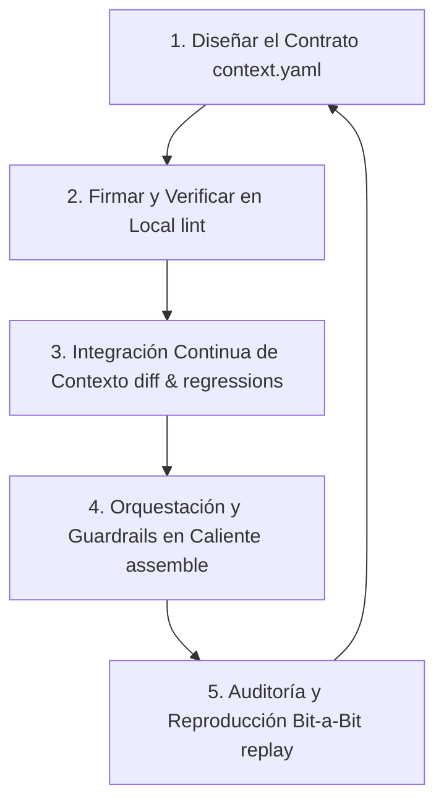

# Context Contract-Driven Development (CCDD)
## Una Metodología para Sistemas de Agentes y LLMs Confiables

> **Documento de motivación (manifiesto).** La especificación normativa —terminología, requisitos MUST/SHOULD, niveles de conformidad y consideraciones de seguridad— vive en `ccdd_spec_v0.3.md`, con esquema formal (`ccdd_context.schema.json`) e implementación de referencia (`ccdd_reference/`). En caso de conflicto, manda la especificación.

---

## 🎯 Propósito

CCDD nace de una pregunta concreta sobre la **cocreación humano–IA**:

> ¿Cómo le delego una tarea a una IA y tengo un grado de confianza alto de que no solo la **ejecutará**, sino que **verificará su propio trabajo** y **evitará alucinar** en lo posible?

La distancia entre *"ejecutar"* y *"ejecutar-verificando"* es la que separa una IA en la que hay que revisar todo a mano de una a la que se le puede **delegar con confianza**. CCDD existe para habilitar esa segunda.

El **contrato de contexto híbrido** es el instrumento de esa confianza:

- **Lo verificable** (estructura, presupuestos, firmas, reglas) lo chequea una máquina, de forma determinista y reproducible → el humano no tiene que *creer*, puede *comprobar*.
- **Lo opinable** (juicio, criterio, comportamiento) queda marcado explícitamente como tal, **fuera** del control automático → ahí el humano mantiene el ojo, y la IA *informa pero no decide*.

El resultado: la IA entrega trabajo **acompañado de su verificación**, con la frontera entre *"esto está comprobado"* y *"esto es criterio"* dibujada de forma honesta. El humano sabe exactamente **hasta dónde puede soltar la mano** — y ese es, en una frase, todo el punto de CCDD.

---

**CCDD (Desarrollo Guiado por Contratos de Contexto)** es una alternativa a metodologías tradicionales como SDD (Specification-Driven Development) o TDD (Test-Driven Development), diseñada específicamente para la era de los sistemas no-deterministas (IA Generativa y Agentes).

En el desarrollo de software clásico, los límites del sistema se definen mediante tipos estáticos y contratos de API (como OpenAPI o Protobuf). En la ingeniería de IA, la única palanca real de control de calidad sobre el comportamiento del modelo es el **contexto**. CCDD eleva el contexto a un artefacto de ingeniería de primer nivel, declarativo, testeable y versionado.

---

## 🧬 El Contrato de Contexto es Híbrido

La idea distintiva de CCDD es que el contrato de contexto **combina dos naturalezas** que las metodologías tradicionales mantienen separadas, y el flujo de trabajo sabe enrutar cada una a donde corresponde:

| Parte **dura** (determinista, se *verifica*) | Parte **blanda** (probabilística, se *juzga*) |
| :--- | :--- |
| Estructura, presupuestos de tokens, firmas, reglas | El comportamiento real del modelo |
| Contexto **estático**: políticas e instrucciones fijas | Contexto **dinámico**: memoria, RAG, entrada del usuario |
| La valida un **control automático** (gate determinista) | La decide un **humano apoyado por un modelo** |

El desarrollo clásico es 100% duro (tipos, compilador) y no sirve para gobernar a un LLM. El "prompt engineering" suelto es 100% blando y no es confiable. CCDD es **híbrido**: un contrato que sostiene ambas a la vez, con una regla de oro — *lo verificable se automatiza; lo opinable lo decide una persona, y el modelo informa pero nunca decide.*

---

## 🔄 El Ciclo de Vida CCDD

El flujo de trabajo CCDD se compone de 5 etapas cíclicas que se ejecutan tanto en tiempo de desarrollo como en integración continua (CI) y tiempo de ejecución (runtime).

### 1. Diseñar el Contrato (`context.yaml`)
El desarrollo comienza definiendo los límites de información del agente. En lugar de escribir prompts monolíticos en código:
- Se definen los **slots** (canales) que alimentarán al modelo.
- Se establece una jerarquía estricta de **prioridad de atención** (token allocation budget).
- Se establecen reglas de **compactación** y **guardrails deterministas** (evitar secretos, comprobar referencias, validar formatos JSON).

### 2. Desarrollo Local y Firmas Estáticas
El desarrollador escribe los prompts estáticos e instrucciones. El framework CCDD:
- Genera firmas criptográficas (`SHA-256`) de los archivos estáticos (`system.txt`, `guidelines.txt`).
- Ejecuta `lint` en local para garantizar que los prompts no tengan referencias rotas a otros slots y que se ajusten a los presupuestos.
- Guarda el archivo `expected-hashes.json` en el repositorio Git.

### 3. Integración Continua de Contexto (CCI)
Cada Pull Request que altere las instrucciones del agente o el contrato de contexto activa un paso de verificación en CI:
- **`diff` Semántico**: Compara el contrato de la rama origen contra `main`.
- **Detección de Regresiones**: Bloquea automáticamente el merge si:
  - Se reduce el presupuesto total de tokens disponible.
  - Se disminuye la prioridad de un slot crítico (ej. degradar `system` o `policies` por debajo de `user_message`), lo que expondría el agente a ataques de secuestro de contexto (Prompt Injection).
  - Un desarrollador modificó las políticas estáticas sin actualizar y firmar criptográficamente el hash.

### 4. Orquestación y Guardrails en Caliente (Runtime)
Cuando el usuario interactúa con la aplicación en producción:
- El orquestador CCDD reúne datos dinámicos (memoria, RAG, variables de sesión).
- El motor de mezcla **asigna dinámicamente los tokens** basándose en la prioridad del contrato. Si el contexto excede el límite del modelo, los slots menos prioritarios son resumidos o truncados automáticamente.
- El validador ejecuta los guardrails deterministas en milisegundos.
- **Si pasa la validación:** Se ensambla el payload y se envía al LLM.
- **Si falla la validación:** Se aborta la ejecución o se enruta a un flujo de contingencia determinista, ahorrando costes de inferencia y previniendo fugas de seguridad.

### 5. Auditoría y Reproducción Bit-a-Bit
En caso de que el modelo cometa una alucinación o un fallo en producción, CCDD permite la trazabilidad absoluta:
- El payload ensamblado se firma y registra junto con el verdict de la validación.
- Los desarrolladores pueden extraer ese snapshot de contexto exacto y reproducir la llamada al LLM **byte-por-byte**, eliminando las variables de drift de base de datos o cambios en el historial.

---

## 🆚 Comparativa de Metodologías

| Dimensión | SDD (Specification-Driven) | TDD (Test-Driven) | CCDD (Context Contract-Driven) |
| :--- | :--- | :--- | :--- |
| **Naturaleza del control** | 100% determinista | 100% determinista | **Híbrida**: parte determinista (se verifica) + parte probabilística (se juzga) |
| **Sistema que gobierna** | Determinista (código). | Determinista (funciones). | **No-determinista** (LLM / agentes). |
| **Foco Principal** | Estructuras de datos y firma de métodos. | Comportamiento esperado de funciones puras. | Calidad de la señal de entrada en sistemas probabilísticos. |
| **Artefacto Clave** | Schema (OpenAPI, GraphQL, Protobuf). | Casos de Prueba (Jest, PyTest, JUnit). | Contrato de Contexto híbrido (`context.yaml`). |
| **Garantía en CI** | Compilación exitosa, validación de tipos. | Porcentaje de cobertura de código (Coverage). | Ausencia de regresiones de políticas y drift de prompts. |
| **Manejo de Fallos** | Excepciones estructuradas en runtime. | Tests rojos que bloquean despliegue. | Truncamiento controlado por prioridad y guardrails pre-inferencia. |

---

## 📈 Beneficios Clave del Flujo CCDD

1. **Garantiza la persistencia de políticas bajo presión de tokens**: Al fijar los slots de entorno y sistema con prioridad máxima (`0` y `1`) y el mensaje del usuario con prioridad `4`, el sistema asegura que bajo estrés de tokens la entrada del usuario se trunca *antes* que las directivas de seguridad. Esto mitiga la *omisión* de políticas por desbordamiento de contexto, pero **no** sustituye la robustez del modelo frente a inyección semántica que sí cabe en el presupuesto (ver `ccdd_spec_v0.3.md` §6, Consideraciones de Seguridad).
2. **Independencia Tecnológica**: El contrato de contexto es puramente declarativo. El equipo de ingeniería puede migrar de LangChain a LangGraph, o de Python a Go, sin reescribir las políticas o la estructura de los prompts. *(Demostrado: `ccdd export --format openai|anthropic|text` emite el mismo contrato en el formato nativo de cada framework — la implementación de referencia lo prueba, no solo lo afirma.)*
3. **QA y Auditoría Determinista**: Convierte el problema difuso de "evaluar prompts" en un conjunto de métricas verificables bit-a-bit en CI.
